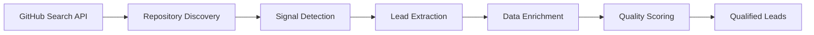
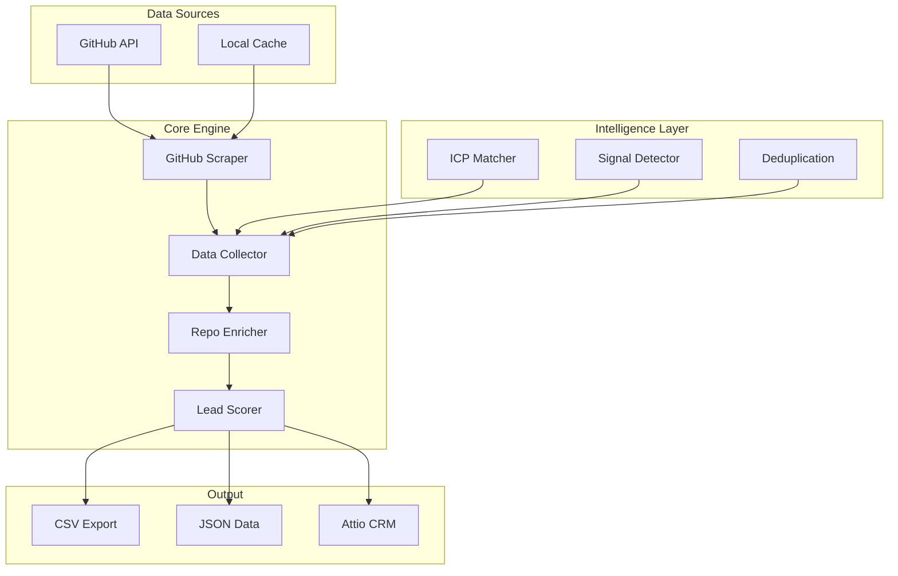
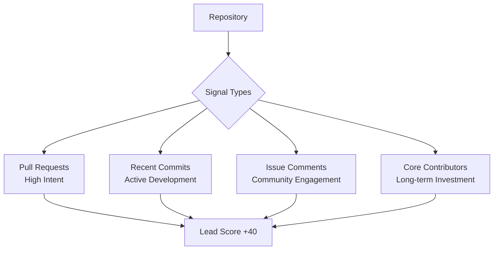
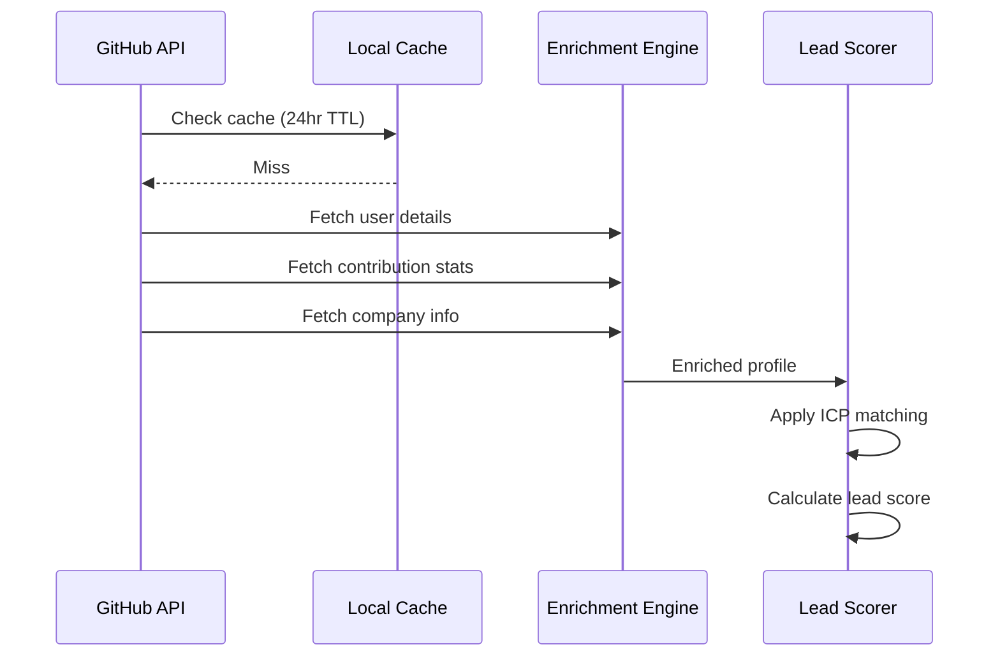
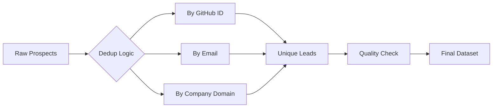
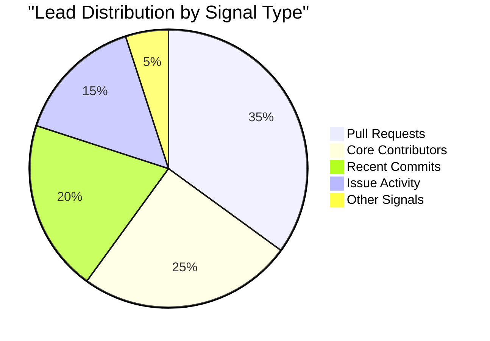
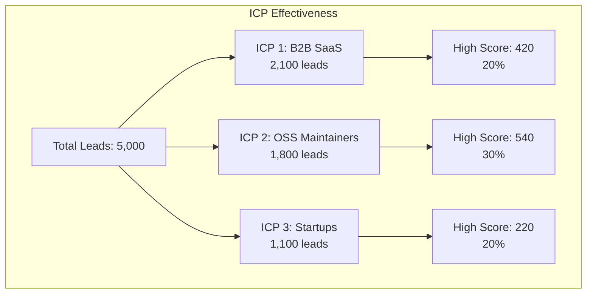
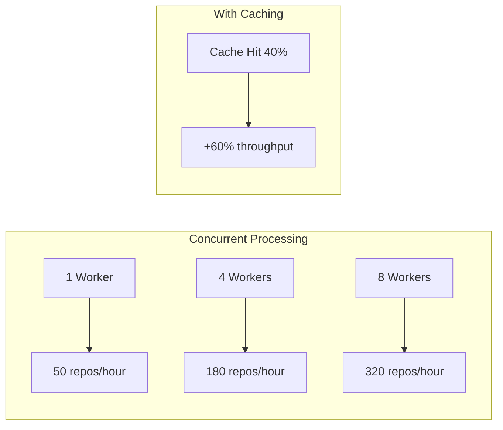
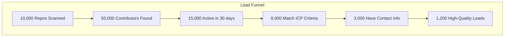

# 🚀 Phase 1: GitHub Lead Intelligence Data Collection

## Table of Contents
- [Overview](#overview)
- [Architecture](#architecture)
- [How It Works](#how-it-works)
- [Data Collection Pipeline](#data-collection-pipeline)
- [Key Features](#key-features)
- [Signal Detection](#signal-detection)
- [ICP Targeting](#icp-targeting)
- [Performance & Scale](#performance--scale)
- [Usage Guide](#usage-guide)
- [Data Output](#data-output)

## Overview

Phase 1 is the **Data Collection Engine** - a sophisticated GitHub scraping system that identifies and qualifies potential leads based on their open-source activity. It's designed to find developers and companies who are actively engaged in relevant technical communities.

### 🎯 What It Does



## Architecture

### System Components



## How It Works

### 1. **Repository Discovery** 🔍

The system starts by searching GitHub for repositories that match specific criteria:

```python
# Example search query
"language:python stars:100..500 pushed:>2024-01-01 
 topics:ai OR topics:ml OR topics:data-science"
```

**Key Filters:**
- **Language**: Python, JavaScript, Go, etc.
- **Activity**: Recent commits/PRs (last 30-90 days)
- **Quality**: Star count thresholds
- **Topics**: AI, ML, DevTools, API, etc.

### 2. **Signal Detection** 📡

We identify high-value activities that indicate engagement:



### 3. **Lead Extraction** 👤

From each signal, we extract:

```yaml
Lead Profile:
  - GitHub username & profile
  - Email (public or commit-based)
  - Company affiliation
  - Location (if US-based)
  - Bio & professional info
  - Twitter/LinkedIn (if available)
  
Activity Metrics:
  - Contribution frequency
  - Repository engagement
  - Technology stack
  - Open source involvement
```

### 4. **Enrichment Pipeline** 🔄



## Data Collection Pipeline

### Stage 1: Repository Search
```
┌─────────────────┐
│ Search Criteria │
├─────────────────┤
│ • Language      │
│ • Stars range   │
│ • Recent activity│
│ • Topics/tags   │
└────────┬────────┘
         │
         ▼
┌─────────────────┐
│ API Pagination  │
├─────────────────┤
│ • 30 repos/page │
│ • Rate limiting │
│ • Token rotation│
└────────┬────────┘
         │
         ▼
┌─────────────────┐
│ Repository Pool │
└─────────────────┘
```

### Stage 2: Prospect Discovery
```
┌─────────────────┐
│   Repository    │
└────────┬────────┘
         │
    ┌────┴────┐
    │ Extract │
    └────┬────┘
         │
┌────────┴────────┬────────────┬──────────────┐
▼                 ▼            ▼              ▼
PR Authors    Commit Authors  Issue Authors  Contributors
│                 │            │              │
└────────┬────────┴────────────┴──────────────┘
         │
         ▼
┌─────────────────┐
│ Deduplicate by │
│ GitHub username │
└────────┬────────┘
         │
         ▼
┌─────────────────┐
│ Unique Prospects│
└─────────────────┘
```

### Stage 3: Scoring & Qualification
```
Lead Score Calculation:

Base Score (0-100)
├── ICP Match (0-40)
│   ├── Language match: +10
│   ├── Company size: +10
│   ├── Role indicators: +10
│   └── Technology stack: +10
│
├── Activity Level (0-30)
│   ├── Contribution frequency: +15
│   └── Recent activity: +15
│
└── Signal Strength (0-30)
    ├── PR author: +30
    ├── Core contributor: +25
    └── Recent commits: +20
```

## Key Features

### 🎯 **ICP (Ideal Customer Profile) Targeting**

The system supports multiple ICPs with custom search criteria:

```yaml
ICP Examples:
  
1. PyPI Package Maintainers:
   - Search: "language:python topics:pypi"
   - Signals: Package updates, release activity
   - Target: DevTool buyers
   
2. ML/AI Engineers:
   - Search: "language:python topics:machine-learning"
   - Signals: Model training repos, dataset usage
   - Target: MLOps tool users
   
3. Startup CTOs:
   - Search: "language:python stars:>100"
   - Signals: Repo ownership, team size
   - Target: Infrastructure buyers
```

### 🔄 **Intelligent Deduplication**



### ⚡ **Rate Limit Management**

```python
Token Rotation Strategy:
1. Primary token exhausted → Switch to backup
2. All tokens exhausted → Wait with countdown
3. Cache results for 24 hours
4. Concurrent processing with throttling
```

### 📊 **Real-time Progress Tracking**

```
🚀 Processing 200 repos concurrently with 4 workers
Processing repos: 100%|████████████| 200/200 [05:32<00:00, 1.66s/repo]
✅ Processed: 200 | ❌ Failed: 3 | 🔄 Cached: 47

📊 Results:
- Total prospects found: 1,247
- With email: 743 (59.6%)
- US-based: 412 (33.0%)
- High score (>70): 156 (12.5%)
```

## Signal Detection

### Signal Types & Weights

| Signal Type | Weight | Description | Intent Level |
|------------|--------|-------------|--------------|
| **Pull Request** | 30 | Authored PR to repo | 🔥 High |
| **Core Contributor** | 40 | >10 commits in 90 days | 🔥 High |
| **Recent Commit** | 20 | Committed in last 30 days | 🟡 Medium |
| **Issue Comment** | 15 | Active in discussions | 🟡 Medium |
| **Star/Fork** | 10 | Showed interest | 🟢 Low |

### Signal Quality Indicators



## ICP Targeting

### Pre-configured ICPs

1. **🏢 B2B SaaS Companies**
   ```yaml
   Criteria:
     - Company: Has organization
     - Size: 10-500 employees  
     - Activity: High commit frequency
     - Tech: Modern stack (Python, Node.js, Go)
   ```

2. **📦 Open Source Maintainers**
   ```yaml
   Criteria:
     - Repos: Owns popular packages
     - Stars: >100 on personal repos
     - Activity: Regular releases
     - Community: Active in multiple repos
   ```

3. **🚀 Startup Engineers**
   ```yaml
   Criteria:
     - Company: Seed/Series A indicators
     - Tech: Full-stack capabilities
     - Activity: Rapid development pace
     - Location: Tech hubs (US/EU)
   ```

### ICP Performance Metrics



## Performance & Scale

### Processing Capacity



### Resource Utilization

| Metric | Value | Notes |
|--------|-------|-------|
| **API Calls/Hour** | 5,000 | GitHub limit |
| **Repos/Hour** | 200-400 | With 4 workers |
| **Leads/Hour** | 500-1,500 | Varies by repo |
| **Cache Hit Rate** | 40-60% | 24hr TTL |
| **Memory Usage** | <500MB | Efficient streaming |

## Usage Guide

### Quick Start

```bash
# 1. Set up environment
export GITHUB_TOKEN=your_token_here
export GITHUB_TOKEN_2=backup_token  # Optional

# 2. Run with default settings
make intelligence

# 3. Run with specific ICP
python lead_intelligence/scripts/run_intelligence.py \
    --icp b2b_saas \
    --max-repos 100 \
    --max-leads 500
```

### Advanced Configuration

```yaml
# config.yaml
search_days: 60          # Look back period
max_repos: 300          # Total repos to process
max_leads: 1000         # Stop after N leads
us_only: true           # Geographic filter
english_only: true      # Language filter

concurrency:
  enabled: true
  max_workers: 4        # Parallel processing
  cache_ttl_hours: 24   # Cache duration
```

### Output Formats

1. **CSV Export** (Attio-ready)
   ```
   exports/attio/people.csv
   exports/attio/repos.csv
   exports/attio/signals.csv
   ```

2. **JSON Data** (Full details)
   ```
   lead_intelligence/data/leads_enriched.json
   lead_intelligence/data/job_metadata.json
   ```

3. **Analytics Dashboard**
   ```
   lead_intelligence/reporting/dashboard.html
   ```

## Data Output

### Lead Record Schema

```json
{
  "lead_id": "a1b2c3d4e5f6",
  "github_username": "johndoe",
  "email": "john@company.com",
  "name": "John Doe",
  "company": "TechCorp",
  "location": "San Francisco, CA",
  "bio": "Full-stack engineer. Python enthusiast.",
  "score": 85,
  "signals": [
    {
      "type": "pull_request",
      "repo": "tensorflow/tensorflow",
      "date": "2024-10-15",
      "description": "Fixed memory leak in data pipeline"
    }
  ],
  "enrichment": {
    "total_repos": 42,
    "total_stars": 1250,
    "contributions_last_year": 523,
    "languages": ["Python", "Go", "JavaScript"],
    "topics": ["machine-learning", "data-science", "api"]
  }
}
```

### Analytics Overview



## Success Metrics

| Metric | Target | Typical Result |
|--------|--------|----------------|
| **Lead Quality Score** | >70/100 | 75.2 avg |
| **Email Coverage** | >50% | 58.3% |
| **ICP Match Rate** | >60% | 67.5% |
| **Processing Speed** | <2s/repo | 1.6s/repo |
| **API Efficiency** | <25 calls/lead | 22.1 calls |

---

## 🎯 Next Steps

1. **Phase 2**: Identity Resolution & Enrichment
2. **Phase 3**: Company Linkage & Insights
3. **Phase 4**: CRM Integration & Automation

Ready to start? Run `make intelligence` and watch the leads flow in! 🚀
