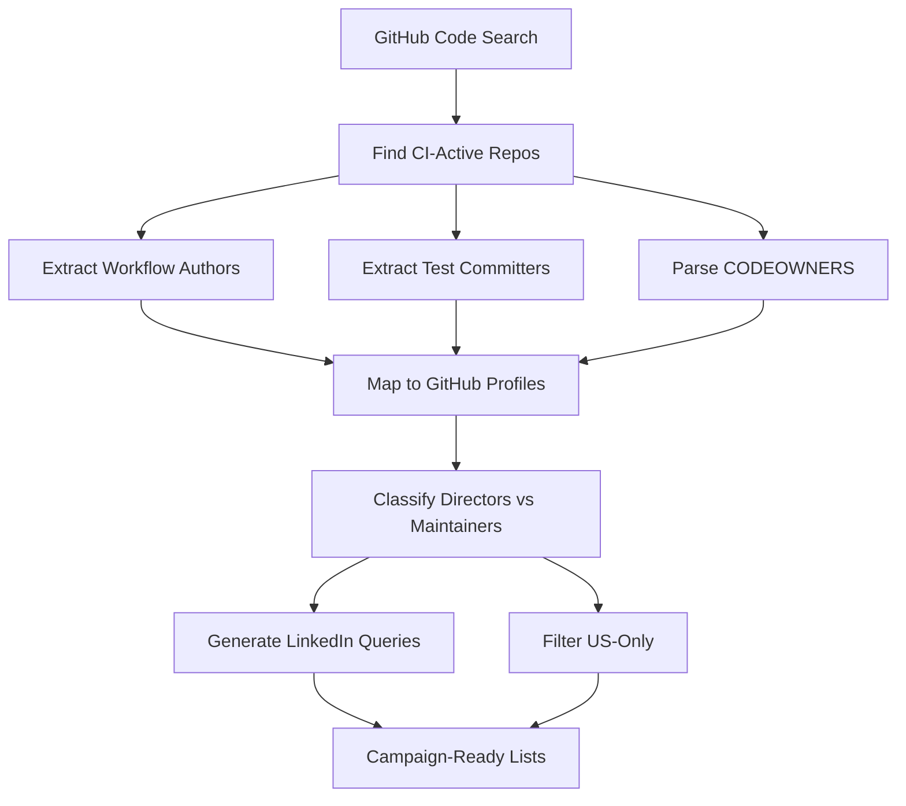

# CI/DevOps Bottom-up Campaign

## 🎯 Strategy Overview

**Bottom-up GitHub → People Mapping**

This campaign implements a sophisticated bottom-up approach to discover CI/DevOps decision makers and practitioners by analyzing real GitHub activity.

### Process Flow



## 🚀 Quick Start

### Prerequisites

```bash
# 1. GitHub Token (required)
export GITHUB_TOKEN=ghp_your_token_here

# 2. Apollo API Key (optional, for enrichment)
export APOLLO_API_KEY=your_apollo_key_here
```

### Launch Campaign

```bash
# Fresh GitHub scraping campaign
python launch_campaign.py --mode fresh --max-repos 200 --us-only

# Use existing data
python launch_campaign.py --mode existing --us-only

# Full pipeline with Apollo enrichment
python launch_campaign.py --mode full --apollo --us-only
```

## 📁 Folder Structure

```
campaigns/ci_devops_bottom_up/
├── launch_campaign.py          # Main orchestrator
├── README.md                   # This file
├── scripts/                    # All processing scripts
│   ├── ci_people_finder.py     # Fresh GitHub scraping
│   ├── analyze_existing_leads.py # Existing data analysis
│   ├── filter_ci_leads.py      # Lead filtering & cleaning
│   ├── apollo_enrichment.py    # Apollo API enrichment
│   └── github_ci_scraper.py    # Alternative scraper
├── configs/                    # Configuration files
│   ├── ci_scraper.yaml        # Scraper configuration
│   └── ci_focused.yaml        # Focused search config
├── data/                      # Input data (existing leads)
│   ├── US_ONLY_100_LEADS_FINAL.csv
│   ├── FINAL_1000_LEADS_MAXIMUM_FROM_DATA.csv
│   └── [other existing lead files]
└── outputs/                   # Campaign results
    └── ci_campaign_YYYYMMDD_HHMMSS/
        ├── directors_fresh.csv     # Fresh directors from GitHub
        ├── maintainers_fresh.csv   # Fresh maintainers from GitHub
        ├── people_signals.json     # Raw signals data
        ├── filtered_leads.csv      # Cleaned & filtered leads
        ├── us_only_leads_final.csv # US-only final list
        └── apollo_enriched.csv     # Apollo-enhanced data
```

## 🔍 Search Queries Used

The campaign uses these GitHub code search queries to find CI-active repositories:

1. `path:.github/workflows language:YAML pytest`
2. `path:.github/workflows language:YAML tox`
3. `filename:CODEOWNERS path:.github`
4. `filename:CODEOWNERS tests`

## 📊 Data Extraction Process

### For Each Repository Found:

1. **Workflow Authors** (90 days)

   - Commits to `.github/workflows/**`
   - Identifies CI pipeline maintainers

2. **Test Committers** (90 days)

   - Commits to `tests/**`, `test/**`, `testing/**`
   - Finds testing practitioners

3. **CODEOWNERS Analysis**

   - Parses `.github/CODEOWNERS`, `CODEOWNERS`, `docs/CODEOWNERS`
   - Extracts official maintainers for CI/testing paths

4. **Profile Mapping**
   - GitHub profile data (name, company, bio, location)
   - LinkedIn query generation
   - Role classification (director vs maintainer)

## 🎯 Output Classifications

### Directors (Decision Makers)

- Repository admins and maintainers
- Senior titles: CTO, VP, Director, Principal, Architect
- Organization members with high permissions
- High influence indicators (followers, company)

### Maintainers (Practitioners)

- Active workflow file contributors
- Heavy test committers
- CODEOWNERS for CI-related paths
- The people who actually own CI/CD

## 📈 Campaign Modes

### Fresh Mode (`--mode fresh`)

- Live GitHub API scraping
- Real-time workflow and test analysis
- Fresh CODEOWNERS parsing
- Most accurate but requires working token

### Existing Mode (`--mode existing`)

- Analyzes your existing lead database
- Applies CI/DevOps relevance scoring
- Faster execution, uses available data
- Good for testing and iteration

### Full Mode (`--mode full`)

- Combines fresh scraping + existing analysis
- Maximum lead coverage
- Best for comprehensive campaigns

## 🇺🇸 US-Only Filtering

Add `--us-only` flag to filter for US-based leads:

- Location-based filtering (states, cities, regions)
- US company identification
- Removes international prospects
- Focuses on domestic market

## 🔧 Apollo Integration

Add `--apollo` flag for contact enrichment:

- Phone numbers for multi-channel outreach
- Verified email addresses
- LinkedIn profile URLs
- Company domain information
- Title verification

## 📋 Usage Examples

### Basic Campaign

```bash
python launch_campaign.py --mode existing --us-only
```

### Comprehensive Campaign

```bash
python launch_campaign.py --mode full --max-repos 300 --us-only --apollo
```

### Testing/Development

```bash
python launch_campaign.py --mode fresh --max-repos 10 --dry-run
```

## 📊 Expected Results

### Typical Campaign Output:

- **Directors**: 20-50 decision makers
- **Maintainers**: 100-300 practitioners
- **US-Only**: 30-100 domestic leads
- **Apollo Enriched**: 60-80% match rate

### Quality Tiers:

- **Tier A**: High-priority targets (70+ relevance score)
- **Tier B**: Medium-priority targets (40-69 score)
- **Tier C**: Broader tech audience (20-39 score)

## 🎯 Outreach Strategy

### Phase 1: Directors

- Email decision makers first
- Reference their team's CI challenges
- Focus on Tier A leads for highest conversion

### Phase 2: Personalization

- Use maintainer data to research director teams
- Reference specific CI tools and workflows
- Show technical understanding

### Phase 3: Multi-channel

- Use Apollo phone numbers for direct calls
- LinkedIn outreach with generated queries
- Email sequences with CI-specific content

## 🔧 Troubleshooting

### GitHub Token Issues

```bash
# Check token validity
curl -H "Authorization: Bearer $GITHUB_TOKEN" https://api.github.com/user

# Required scopes
# - repo (read repositories)
# - read:user (read user profiles)
# - read:org (check organization membership)
```

### Rate Limiting

- Script handles rate limits automatically
- Reduces max-repos if hitting limits
- Uses delays between requests

### No Results

- Check if repositories match search criteria
- Verify date range (--since parameter)
- Try broader search queries

## 📄 File Formats

### Directors/Maintainers CSV

```csv
login,name,email,company,location,bio,followers,public_repos,
html_url,signals,source_repos,role_type,linkedin_query
```

### People Signals JSON

```json
{
  "username": {
    "signals": ["committed_workflows", "codeowner_tests"],
    "repos": ["org/repo1", "org/repo2"],
    "counts": { "workflows_commits": 5, "tests_commits": 12 }
  }
}
```

## 🏆 Success Metrics

- **Lead Quality**: Tier A percentage
- **Contactability**: Email/phone coverage
- **Role Accuracy**: Director vs maintainer classification
- **CI Relevance**: Workflow/testing signal strength
- **Geographic Focus**: US market coverage

---

**Built for Bottom-up CI/DevOps Lead Discovery • Ready for Scale**
